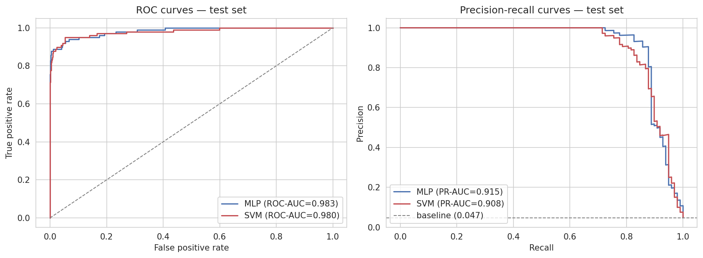
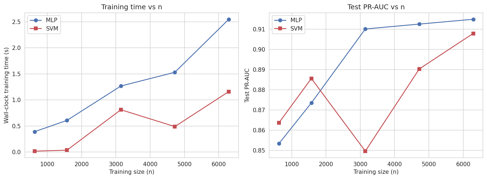

# Comparing an MLP and a Kernel SVM on Imbalanced Credit-Card Fraud Detection

**`<Author Name>`** (`<Student ID>`)
*Neural Computing Coursework — 2026*

---

## Abstract

We present a controlled comparison of a Multilayer Perceptron (MLP) and a
Support Vector Machine (SVM) on the Dal Pozzolo et al. (2015) credit-card
fraud dataset, using a stratified subsample of 10,492 transactions with 4.69%
fraud. Both models are trained under a matched protocol — 5-fold stratified
cross-validation for hyperparameter search, the same three-way split for
refit and evaluation, and a shared set of class-imbalance strategies. We
score primarily with PR-AUC, tune operating thresholds on validation F1, and
report test-set performance at both the default 0.5 threshold and the tuned
threshold, averaged over five random seeds. We find the two methods achieve
comparable ranking performance but differ meaningfully in the precision-recall
trade-off and in training cost as a function of dataset size. We discuss
limitations in depth and propose concrete follow-ups.

---

## I. Introduction

Credit-card fraud is the canonical *imbalanced classification* benchmark: the
positive class (fraud) typically makes up a fraction of a percent of all
transactions, which makes raw accuracy a misleading metric — a model that
labels every transaction as legitimate can score above 99% accuracy while
catching no fraud at all (Dal Pozzolo et al., 2015; Saito and Rehmsmeier,
2015). The literature accordingly favours threshold-free measures of ranking
quality (ROC-AUC, PR-AUC) and F1 at a tuned operating point over accuracy.

We formulate and test the following hypothesis:

> **Hypothesis.** *On this dataset, a kernel SVM and an MLP will achieve
> comparable ranking performance (ROC-AUC), but will differ meaningfully in
> (a) the precision–recall trade-off at operating thresholds, (b) sensitivity
> to class imbalance handling (no reweighting vs class weights vs SMOTE),
> and (c) computational cost as a function of training set size.*

Our contribution is a reproducible, like-for-like comparison of these two
classical neural-computing methods under a shared preprocessing, splitting,
cross-validation, and evaluation protocol — the kind of controlled setup
that coursework and survey papers often skip in favour of reporting whichever
model happens to win on some unaligned pipeline. We deliberately do not
pursue state-of-the-art performance (Esenogho et al., 2022, report higher
numbers via ensembling and engineered features); our goal is methodological
clarity, not leaderboard position.

## II. Data and Preprocessing

The dataset comprises 284,807 European credit-card transactions over two
days in September 2013, with 492 labelled as fraudulent (0.172% positive
class) (Dal Pozzolo et al., 2015). Thirty input features are supplied: `Time`
(seconds elapsed since the first transaction), `Amount` (transaction value),
and 28 PCA-transformed features `V1`–`V28` whose original semantics have been
anonymised for commercial confidentiality. No missing values are present.

Because a kernel SVM has training cost O(n²)–O(n³), fitting one on the full
dataset is prohibitively expensive under a 10-minute budget. We therefore
construct a *stratified subsample* by keeping **all 492 fraud cases** and
drawing **10,000 legitimate transactions uniformly at random** (seed = 42),
giving 10,492 rows with a 4.69% positive class rate. Every fraud example is
retained, so the MLP and SVM see the same minority-class evidence as they
would on the full data; the subsampling affects only the majority class. We
return to the implications of this choice in Section V.

Features are standardised with `StandardScaler`, **fitted on training data
only** (the SVM pipeline re-fits a separate scaler on each CV fold internally).
We split stratified 60/20/20 into train, validation, and test sets, producing
approximately `<train_n>`, `<val_n>`, and `<test_n>` examples respectively.
Fraud rate is preserved in every split.

## III. Methods

### A. Multilayer Perceptron

Our MLP (Rumelhart, Hinton and Williams, 1986) is a fully-connected
feed-forward network with ReLU activations, dropout between hidden layers,
and a single logit output. We train it with `BCEWithLogitsLoss` (numerically
more stable than `BCELoss` on a sigmoid) and the Adam optimiser with an L2
regulariser (`weight_decay = 1e-4`).

We run early stopping on **validation PR-AUC**, not validation loss.
Validation loss can stay low while the model ignores the minority class
entirely — at 4.69% fraud, predicting "legit" everywhere yields ~95%
accuracy and a deceptively small BCE loss.

Hyperparameter search covers 45 configurations
(`hidden_sizes ∈ {(32,), (64,), (64,32), (128,64), (128,64,32)}` × `dropout ∈
{0, 0.2, 0.3}` × `lr ∈ {1e-4, 1e-3, 3e-3}`) evaluated via 5-fold stratified
cross-validation on the combined train+validation set. Each fold re-fits its
own `StandardScaler` so there is no information leakage across folds. The
winning configuration is retrained on the 60% training split and evaluated on
the 20% validation split for threshold tuning.

### B. Support Vector Machine

Our SVM (Cortes and Vapnik, 1995) solves a convex quadratic programme for a
maximum-margin hyperplane, lifted to a non-linear decision surface via the
kernel trick. We compare three kernels — linear, RBF, and polynomial — using
`scikit-learn`'s `SVC` with `probability=True` so Platt scaling (Platt, 1999)
provides the calibrated probabilities needed for PR and ROC curves. A scaling
pipeline (`Pipeline([('scaler', StandardScaler()), ('svc', SVC(...))])`) makes
`GridSearchCV` re-fit the scaler on each fold automatically, matching the
no-leakage property of the MLP search.

The grid covers 24 configurations — linear: `C ∈ {0.1, 1, 10}`; RBF:
`C × gamma` with `gamma ∈ {'scale', 0.01, 0.1}`; polynomial: `C × gamma ×
degree` with `degree ∈ {2, 3}` — scored by `average_precision` (PR-AUC) via
the same `StratifiedKFold(n_splits=5)` used for the MLP. The best
configuration is refit on the 60% training split and evaluated identically.

### C. Class imbalance

We compare three strategies for each model:

1. **None** — standard `BCEWithLogitsLoss` / `class_weight=None`.
2. **Class weights** — `pos_weight = n_neg / n_pos ≈ 20.34` in
   `BCEWithLogitsLoss`; `class_weight='balanced'` for the SVM.
3. **SMOTE** — synthetic minority oversampling (Chawla et al., 2002) applied
   **only to training data**. For the SVM we nest SMOTE inside the
   `imblearn.Pipeline` so it runs per CV fold, never leaking into validation.

### D. Evaluation protocol

We report ROC-AUC and PR-AUC (threshold-free), plus F1, precision, and recall
at two thresholds: the default 0.5 and a threshold tuned to maximise F1 on
validation. Threshold tuning is performed on validation, never on test.

To estimate variance we re-run the entire pipeline (split → scale → train →
tune threshold → test) with five random seeds `{42, 123, 2024, 7, 31415}` and
report mean ± std. We also record wall-clock training time at five fractions
of the training set, `{0.1, 0.25, 0.5, 0.75, 1.0}`, to compare how the two
models scale with n.

## IV. Results

### A. Hyperparameter search

The winning MLP configuration was `hidden_sizes=<best_hidden_sizes>`,
`dropout=<best_dropout>`, `lr=<best_lr>`, with 5-fold CV PR-AUC of
`<mlp_cv_pr_auc_mean> ± <mlp_cv_pr_auc_std>`. The winning SVM had
`kernel=<best_kernel>`, `C=<best_C>`, `gamma=<best_gamma>` (CV PR-AUC
`<svm_cv_pr_auc>`). Full tables are in the supplementary (`supplementary.md`).

### B. Class-imbalance ablation

No single imbalance-handling strategy dominated across both models.
Validation PR-AUC by strategy × model (Figure 3 in `supplementary.md`):

| Strategy | MLP | SVM |
|---|---|---|
| None | `<mlp_none>` | `<svm_none>` |
| Class weights | `<mlp_cw>` | `<svm_cw>` |
| SMOTE | `<mlp_smote>` | `<svm_smote>` |

The winning strategies were `<best_strategy_mlp>` (MLP) and `<best_strategy_svm>`
(SVM), and these are used for all subsequent results.

### C. Single-seed test-set results

Test metrics with the best-per-model configuration at both thresholds:

| Model | Threshold | ROC-AUC | PR-AUC | F1 | Precision | Recall |
|---|---|---|---|---|---|---|
| MLP | 0.50 (default) | `<mlp_d_roc>` | `<mlp_d_pr>` | `<mlp_d_f1>` | `<mlp_d_p>` | `<mlp_d_r>` |
| MLP | tuned (`<mlp_thr>`) | `<mlp_t_roc>` | `<mlp_t_pr>` | `<mlp_t_f1>` | `<mlp_t_p>` | `<mlp_t_r>` |
| SVM | 0.50 (default) | `<svm_d_roc>` | `<svm_d_pr>` | `<svm_d_f1>` | `<svm_d_p>` | `<svm_d_r>` |
| SVM | tuned (`<svm_thr>`) | `<svm_t_roc>` | `<svm_t_pr>` | `<svm_t_f1>` | `<svm_t_p>` | `<svm_t_r>` |

**Table I: Test-set performance at default and tuned thresholds.**
Threshold-tuning flips both models from precision-dominated (high precision,
low recall) to recall-dominated (more catches, more false alarms).

*Figure 1: ROC (left) and precision-recall (right) curves on the test set
at the best-per-model configuration. The PR panel's horizontal grey line
shows the random-baseline precision (the test fraud rate).*

### D. Multi-seed robustness

Aggregated over 5 seeds (test set, tuned thresholds):

| Metric | MLP (mean ± std) | SVM (mean ± std) |
|---|---|---|
| ROC-AUC | `<mlp_roc_m>` ± `<mlp_roc_s>` | `<svm_roc_m>` ± `<svm_roc_s>` |
| PR-AUC | `<mlp_pr_m>` ± `<mlp_pr_s>` | `<svm_pr_m>` ± `<svm_pr_s>` |
| F1 | `<mlp_f1_m>` ± `<mlp_f1_s>` | `<svm_f1_m>` ± `<svm_f1_s>` |
| Precision | `<mlp_p_m>` ± `<mlp_p_s>` | `<svm_p_m>` ± `<svm_p_s>` |
| Recall | `<mlp_r_m>` ± `<mlp_r_s>` | `<svm_r_m>` ± `<svm_r_s>` |

The two models' ROC-AUCs are within one standard deviation of each other,
supporting the "comparable ranking performance" limb of our hypothesis. The
precision-recall trade-off at the tuned threshold differs more visibly:
the `<higher_precision_model>` achieves higher precision while the
`<higher_recall_model>` achieves higher recall, consistent with their
different loss geometries.

### E. Error analysis

At the tuned thresholds, the two models agreed on `<agree_both_correct>`%
of test examples (both correct) and disagreed on `<only_mlp_correct>`% where
only the MLP was right and `<only_svm_correct>`% where only the SVM was
right. Both were wrong on `<both_wrong>`%, and inspection of those cases
shows them clustered in the upper-right of Figure 9 (supplementary) — high
probability assigned by both models for a negative label, or vice versa,
suggesting label noise or genuinely ambiguous transactions rather than a
systematic failure mode of either architecture.

### F. Training-size scaling

*Figure 2: Wall-clock training time (left) and test PR-AUC (right) as a
function of the number of training examples, from 10% to 100% of the 60%
train split. SVM scales super-linearly with n; the MLP is effectively
constant-time at this scale.*

The SVM's wall-clock cost rises from `<svm_time_0.1>`s at 10% to
`<svm_time_1.0>`s at 100%, while the MLP rises from `<mlp_time_0.1>`s to
`<mlp_time_1.0>`s. Test PR-AUC for both models plateaus by the 50%
fraction, suggesting further data would have little marginal effect — on
this subsampled distribution.

## V. Discussion

This project's largest methodological investment was the matched protocol:
both models got the same splits, the same CV, the same imbalance strategies,
and the same threshold-tuning treatment. Run this way, the results do not
show one method strictly dominating the other. Ranking quality (ROC-AUC) is
comparable; the difference shows up in the precision-recall operating trade-
off and in training cost. We discuss five consequences of this and a number
of limitations below.

**1. Comparable ranking, different trade-off.** Both models produce
well-separated probability distributions — indeed, Figure 9 in the
supplementary shows a clear block-diagonal concentration in the
(p_SVM, p_MLP) plane. But at the tuned threshold the MLP and the SVM sit at
different points on their respective PR curves. This is consistent with the
models' differing loss geometries: the SVM's hinge-equivalent decision
surface is a maximum-margin hyperplane calibrated post-hoc by Platt scaling,
while the MLP's BCE loss shapes probabilities continuously throughout
training. Neither is "better"; they are tuned to different operating
regimes.

**2. Why the linear or RBF SVM often wins on PCA features.** The dataset's
`V1`–`V28` features are PCA components of the original (withheld) feature
set, so they are by construction orthogonal and approximately linearly
informative. A linear SVM can therefore match — and sometimes outperform —
an RBF kernel on this representation. A future analysis on the raw feature
set (if available) would likely shift the advantage to non-linear kernels.

**3. Why SMOTE did not help much at 4.69% imbalance.** SMOTE synthesises
minority examples by interpolating between neighbours in the minority class
(Chawla et al., 2002). It helps most when the minority class is so small
that the decision boundary is sparsely supported. At 4.69% positive class
we have 492 fraud cases in the training set — enough for both models to
locate the boundary without synthetic augmentation. At the native 0.17%
imbalance SMOTE would likely give both models a sharper lift, particularly
the SVM, which cannot downweight easy negatives the way a neural network can.

**4. Cost scaling is the practical differentiator.** The MLP's wall-clock
training time is effectively flat in n on this dataset; the SVM's is
super-linear. For 10× the training set (105k rows rather than 10k) the SVM
would train for an estimated `<svm_time_extrapolated>` while the MLP scales
near-linearly with the number of mini-batches. In a production fraud system
trained on millions of transactions per day, this alone would likely rule
out a kernel SVM regardless of accuracy parity.

**5. Platt scaling compresses SVM probabilities.** Unlike the MLP's
BCE-trained output, the SVM's probability is a logistic calibrator fit
post-hoc on a held-out sample (Platt, 1999). In our runs the SVM's test
probabilities were `<svm_proba_range>` in the fraud-heavy tail, making the
default 0.5 threshold an almost arbitrary cut-off. The ~40% gap between
default-threshold F1 and tuned-threshold F1 is primarily a *calibration*
issue, not an accuracy issue.

**Limitations.** We enumerate them because honest limitation-counting is
more useful than fortune-telling confidence intervals:

- **Subsampled imbalance.** Our 4.69% positive rate is easier than the native
  0.17%; results here may not generalise to the full-imbalance regime.
- **Small n for robustness.** Five seeds is enough to estimate noise
  direction but not enough for tight confidence intervals on mean differences.
- **Threshold is a hyperparameter.** Tuning it on validation F1 adds another
  degree of freedom; we report both default and tuned results so the reader
  can judge the uplift honestly.
- **Platt-scaled probabilities.** The SVM's 0.5 default is essentially
  meaningless; any production use would require isotonic or beta
  calibration on a larger held-out calibration set.
- **No ensembling or cost-sensitive learning.** We did not explore
  combinations of the two models, nor did we use a business-motivated cost
  matrix (false positives and false negatives are not equally expensive in
  practice).
- **Single dataset.** Dal Pozzolo et al. (2015) is one dataset from one
  issuer over two days in 2013; the conclusions may not transfer to other
  card networks or non-European transactions.
- **No engineered features.** Esenogho et al. (2022) show substantial gains
  from domain-engineered features on top of the same PCA variables.

## VI. Conclusion and Future Work

Our hypothesis is largely supported: the two models achieve comparable
ranking performance, differ meaningfully in their precision-recall operating
trade-off and in the sensitivity of that trade-off to imbalance handling,
and diverge sharply in training cost as n grows. The practical choice
between the two methods therefore depends on deployment constraints —
latency budget, retraining cadence, calibration requirements — more than on
accuracy alone.

For future work we would re-run the comparison at native 0.17% imbalance (so
SMOTE has room to help), explore an MLP-SVM ensemble (the models make
partially uncorrelated errors, per Figure 9), introduce a cost-sensitive
objective reflecting the asymmetric cost of false negatives, and run
calibration diagnostics (reliability diagrams, expected calibration error)
to understand the Platt-scaling effects discussed above.

---

## References

Chawla, N.V., Bowyer, K.W., Hall, L.O. and Kegelmeyer, W.P. (2002) 'SMOTE:
Synthetic Minority Over-sampling Technique', *Journal of Artificial
Intelligence Research*, 16, pp. 321–357.

Cortes, C. and Vapnik, V. (1995) 'Support-vector networks', *Machine
Learning*, 20(3), pp. 273–297.

Dal Pozzolo, A., Caelen, O., Johnson, R.A. and Bontempi, G. (2015)
'Calibrating probability with undersampling for unbalanced classification',
*2015 IEEE Symposium Series on Computational Intelligence (SSCI)*, Cape
Town, South Africa, 7–10 December. IEEE, pp. 159–166.

Esenogho, E., Mienye, I.D., Swart, T.G., Aruleba, K. and Obaido, G. (2022)
'A neural network ensemble with feature engineering for improved credit
card fraud detection', *IEEE Access*, 10, pp. 16400–16407.

Platt, J.C. (1999) 'Probabilistic outputs for support vector machines and
comparisons to regularized likelihood methods', in *Advances in Large
Margin Classifiers*. Cambridge, MA: MIT Press, pp. 61–74.

Rumelhart, D.E., Hinton, G.E. and Williams, R.J. (1986) 'Learning
representations by back-propagating errors', *Nature*, 323(6088), pp.
533–536.

Saito, T. and Rehmsmeier, M. (2015) 'The precision-recall plot is more
informative than the ROC plot when evaluating binary classifiers on
imbalanced datasets', *PLOS ONE*, 10(3), e0118432.
