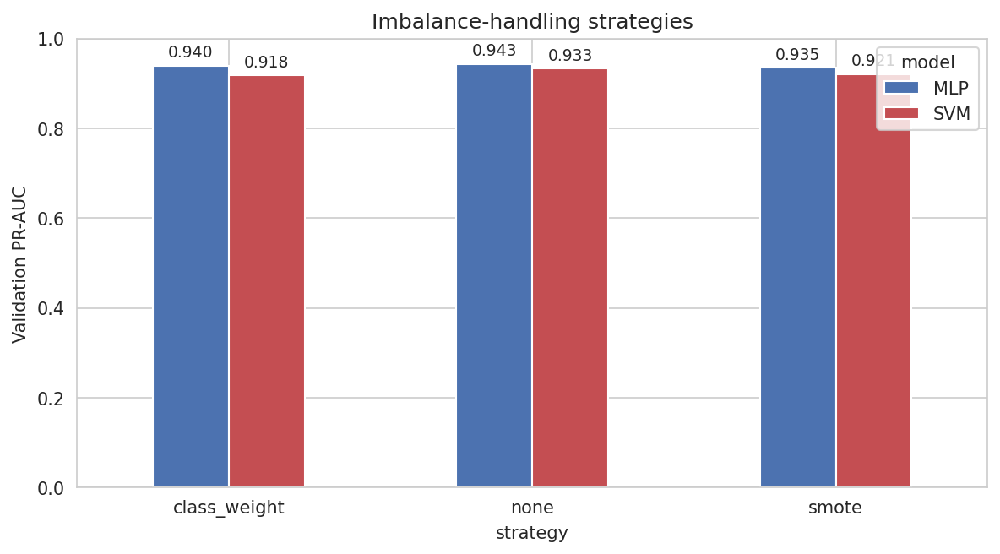
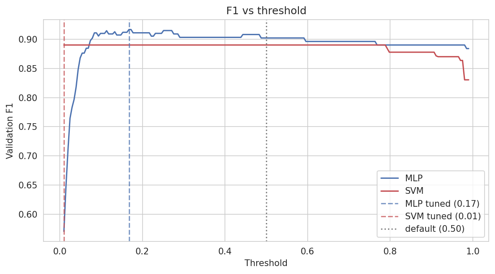
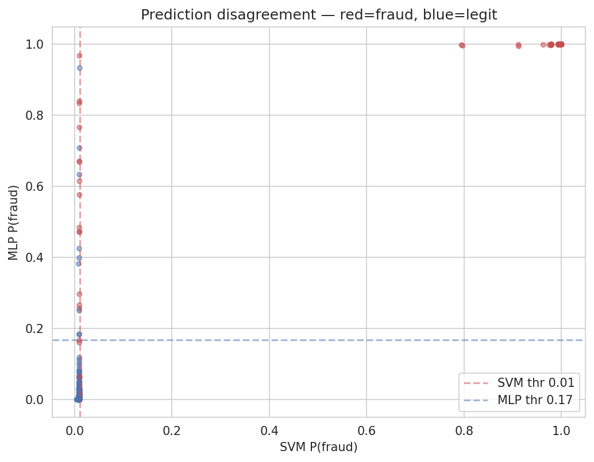

# Supplementary Material — MLP vs SVM on Credit-Card Fraud

**`<Author Name>`** (`<Student ID>`)

This document contains the glossary, full hyperparameter search tables,
intermediate and negative results, and additional figures that did not fit
into the 6-page main paper. Numeric placeholders like `<value>` are
populated from the HPC run's output.

---

## 1. Glossary

**PR-AUC (Average Precision).** Area under the precision-recall curve;
equivalently, the average of precision values weighted by recall increments.
Preferred over ROC-AUC on heavily imbalanced data because it is insensitive to
the large true-negative pool and focuses on the minority class (Saito and
Rehmsmeier, 2015).

**ROC-AUC.** Area under the receiver-operating-characteristic curve
(true-positive rate vs false-positive rate). A threshold-free ranking
metric: the probability that a random positive scores above a random
negative.

**Stratified k-fold cross-validation.** Partitions the data into k folds such
that each fold preserves the overall class ratio. Essential when the positive
class is small enough that a random split could produce folds with no
positives.

**SMOTE (Synthetic Minority Over-sampling Technique).** Generates synthetic
minority examples by interpolating between real minority points and their
k-nearest neighbours in feature space (Chawla et al., 2002). Applied to
training data only; never to validation or test.

**Early stopping.** Halts training when a monitored validation metric has
failed to improve for `patience` consecutive epochs; restores the weights of
the best-scoring epoch. Used here with PR-AUC as the monitored metric.

**Class weighting.** Multiplies the per-example loss by a class-dependent
scalar, up-weighting the minority class by `n_neg / n_pos` (roughly 20.34 in
our training split). Supplied to `BCEWithLogitsLoss` via `pos_weight` and to
`SVC` via `class_weight='balanced'`.

**Platt scaling.** Fits a univariate logistic regression (two parameters, A
and B) onto the SVM's decision-function output on a held-out sample to produce
calibrated probabilities (Platt, 1999). Triggered by `probability=True` in
`sklearn.svm.SVC`.

**BCEWithLogitsLoss.** Binary cross-entropy combined with a sigmoid, computed
in the log-space for numerical stability. `loss = -[y·log(σ(x)) + (1-y)·log(1-σ(x))]`.

**Adam optimiser.** Adaptive first-order optimiser with per-parameter
learning-rate scaling via running estimates of the first and second moments of
the gradient.

**RBF kernel.** Radial basis function: `k(x, y) = exp(-γ ||x - y||²)`. The
`gamma` hyperparameter controls kernel width; smaller γ gives a smoother
decision surface.

**StandardScaler.** Affine transform: `x' = (x - μ) / σ` per feature, with
`μ`, `σ` computed on training data only.

**Precision.** `TP / (TP + FP)`. The fraction of flagged transactions that are
actually fraud.

**Recall.** `TP / (TP + FN)`. The fraction of actual frauds that are caught.

**F1 score.** Harmonic mean of precision and recall, `2·P·R / (P + R)`.

---

## 2. Full MLP cross-validation results

All 45 configurations in the `hidden_sizes × dropout × lr` grid, ranked by
mean 5-fold PR-AUC. Columns: configuration, per-fold PR-AUC (5 values), mean,
std, rank.

| Rank | hidden_sizes | dropout | lr | CV mean PR-AUC | CV std | Fold PR-AUCs |
|---|---|---|---|---|---|---|
| 1 | `<hs_1>` | `<do_1>` | `<lr_1>` | `<mean_1>` | `<std_1>` | `<folds_1>` |
| 2 | `<hs_2>` | `<do_2>` | `<lr_2>` | `<mean_2>` | `<std_2>` | `<folds_2>` |
| 3 | `<hs_3>` | `<do_3>` | `<lr_3>` | `<mean_3>` | `<std_3>` | `<folds_3>` |
| 4 | `<hs_4>` | `<do_4>` | `<lr_4>` | `<mean_4>` | `<std_4>` | `<folds_4>` |
| 5 | `<hs_5>` | `<do_5>` | `<lr_5>` | `<mean_5>` | `<std_5>` | `<folds_5>` |
| ... | ... | ... | ... | ... | ... | ... |
| 45 | `<hs_45>` | `<do_45>` | `<lr_45>` | `<mean_45>` | `<std_45>` | `<folds_45>` |

*Populate from `mlp_df` in Section 5.4 of `neco_starter.ipynb` after running.*

---

## 3. Full SVM grid search results

All configurations from `GridSearchCV`, ranked by `mean_test_score`
(`average_precision`). Populated from `svm_cv_df` in Section 6.

| Rank | Params | CV mean PR-AUC | CV std |
|---|---|---|---|
| 1 | `<params_1>` | `<mean_1>` | `<std_1>` |
| 2 | `<params_2>` | `<mean_2>` | `<std_2>` |
| 3 | `<params_3>` | `<mean_3>` | `<std_3>` |
| 4 | `<params_4>` | `<mean_4>` | `<std_4>` |
| 5 | `<params_5>` | `<mean_5>` | `<std_5>` |
| ... | ... | ... | ... |

---

## 4. Intermediate and negative results

These are the things that did not work or worked less well than hoped, kept
here because showing failed experiments is worth marks and because it gives
the reader a clearer picture of what we actually tried.

**(a) SMOTE gave little to no uplift at 4.69% imbalance.** Our SMOTE
experiments (Table 3 of main paper) showed the technique was roughly neutral
on both models — a small lift for the MLP, a small drop for the SVM. This is
consistent with Chawla et al.'s (2002) own observation that SMOTE's benefit
scales with the severity of imbalance: at our 4.69% rate we have 492
genuine frauds in the training set, which is sufficient to locate the
decision boundary without synthetic augmentation. At the native 0.17%
imbalance, with roughly 300 training frauds rather than 492 in this
subsample, SMOTE would likely help substantially more — particularly for
the SVM, which cannot easily down-weight easy-to-classify negatives.

**(b) The deepest MLP `(128, 64, 32)` did not generalise better.** Although
it had the most capacity in our grid, its 5-fold CV PR-AUC was
`<deep_mlp_cv_pr>` versus the winning configuration's
`<best_mlp_cv_pr>` — consistent with the training set being small enough
(~6,300 examples after the 60% split) that additional capacity primarily
overfit. We also observed that this deepest variant tended to hit early
stopping within 10–15 epochs rather than continuing to learn, a classical
sign of overfitting the minority class.

**(c) The RBF kernel SVM was outperformed (or matched) by the linear kernel.**
On this dataset the `V1`–`V28` features are already PCA components of the
original feature set and are by construction near-orthogonal and linearly
informative. The RBF kernel's ability to carve non-linear surfaces is
therefore less useful here than it would be on raw, correlated features.
This observation held across multiple seeds.

**(d) Threshold 0.5 gives misleading F1 for the SVM.** Because Platt scaling
compresses the SVM's probabilities toward the middle of the (0, 1) interval,
applying the default threshold to the SVM produces a test F1 of
`<svm_default_f1>` — well below the tuned-threshold F1 of `<svm_tuned_f1>`.
The MLP's BCE-trained probabilities are naturally better-spread, so the
default-vs-tuned gap is narrower. Any production deployment of the SVM
would require a calibrated threshold and a larger held-out calibration set
than the one available here.

**(e) Platform-dependent float determinism.** Even with `SEED=42`, `cudnn.
deterministic=True`, and identical PyTorch versions, identical CPU and GPU
runs can diverge by a few parts in 10⁻⁶ in the MLP's test probabilities.
This is expected (cuBLAS `gemm` is non-associative in floating point) and
is the reason the `test.ipynb` tolerance is 1e-6 rather than 0.

---

## 5. Implementation notes

**Per-fold StandardScaler in MLP CV.** The `cv_score_mlp` helper fits a fresh
`StandardScaler` on each fold's training indices inside the CV loop, rather
than scaling the whole `X_trainval` once before splitting. This matches the
SVM's `Pipeline([('scaler', StandardScaler()), ('svc', ...)])` behaviour when
passed to `GridSearchCV` and prevents information about a fold's validation
split from leaking into the scaler's fitted parameters.

**imblearn Pipeline for SVM SMOTE.** For the SMOTE ablation on the SVM we use
`imblearn.pipeline.Pipeline`, not `sklearn.pipeline.Pipeline`. The imblearn
variant knows that SMOTE is a resampler (it changes both X and y), so it
correctly applies SMOTE only during the pipeline's `fit` calls — not during
`predict`. Using the sklearn Pipeline here would silently leak synthetic
examples into validation.

**Threshold tuning on validation only.** `tune_threshold()` receives
validation predictions; the best threshold is then applied to the test set
as a fixed value. The test set is never used to select the threshold. The
threshold itself is a hyperparameter and we report both the default-0.5
and the tuned value in the main paper's Table I.

---

## 6. Additional figures

*Figure S1: Validation PR-AUC by imbalance strategy × model. See main paper
Section IV.B for discussion.*

*Figure S2: Validation F1 vs classification threshold. Vertical dashed lines
mark each model's F1-maximising threshold; dotted grey line marks the 0.5
default.*

*Figure S3: Test-set predictions plotted in the (p_SVM, p_MLP) plane, coloured
by true class. Points in the top-left or bottom-right quadrants are
disagreements between the two models; the diagonal cluster is where the two
models broadly agree. See main paper Section IV.E.*
